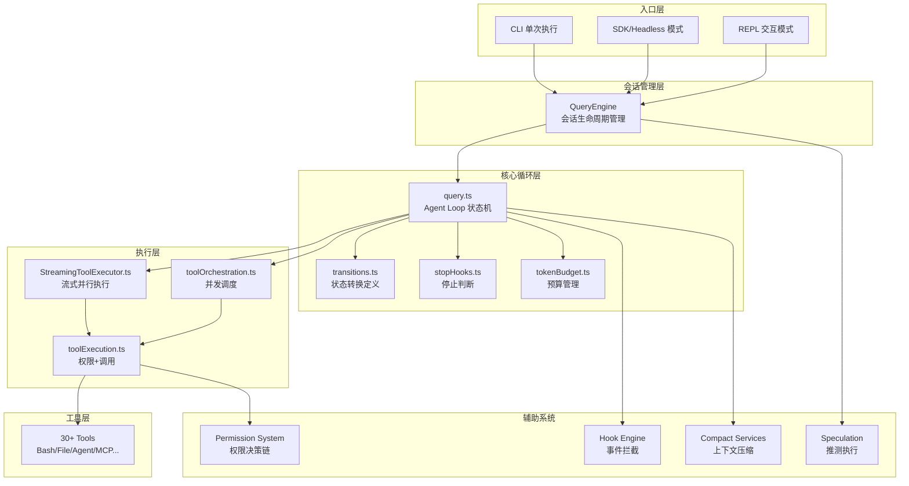
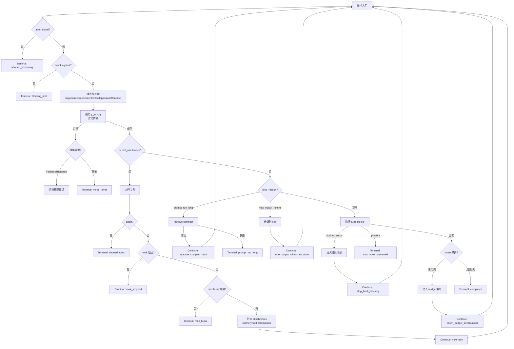
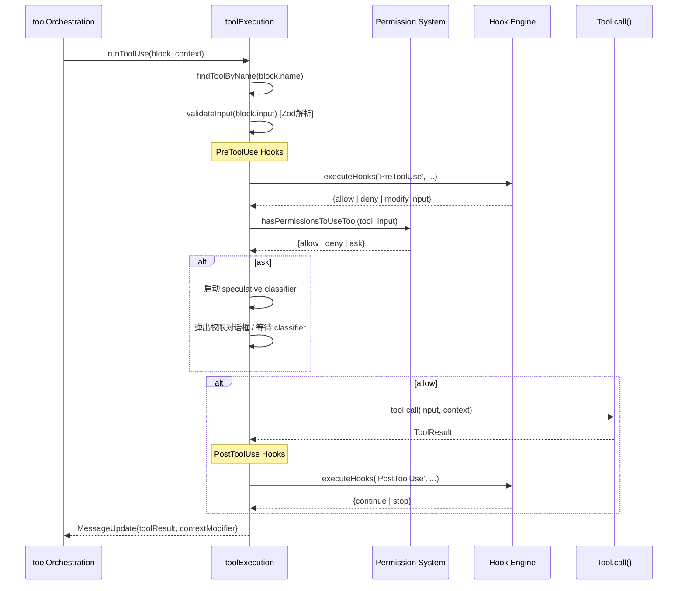
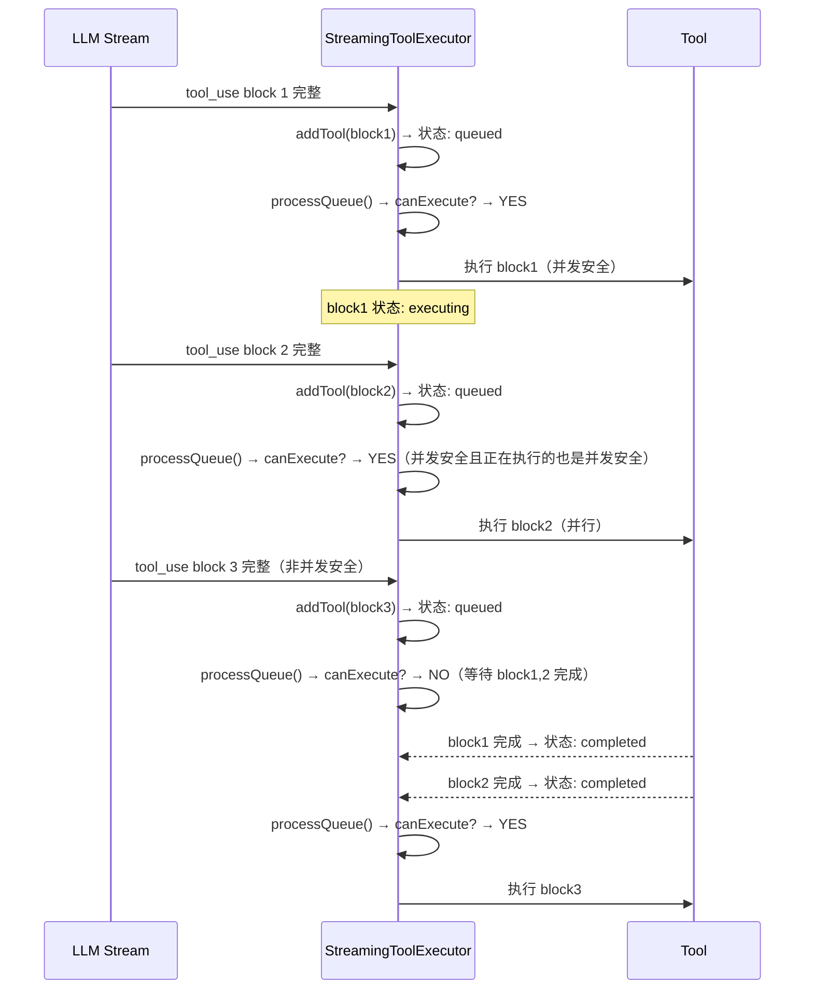
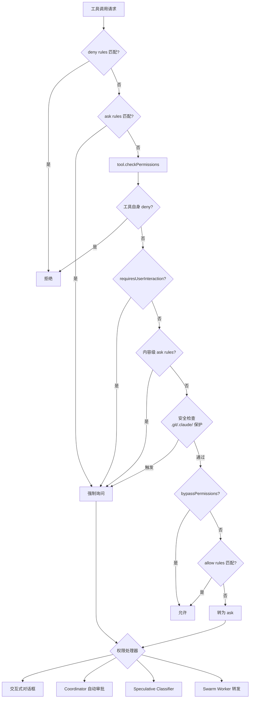
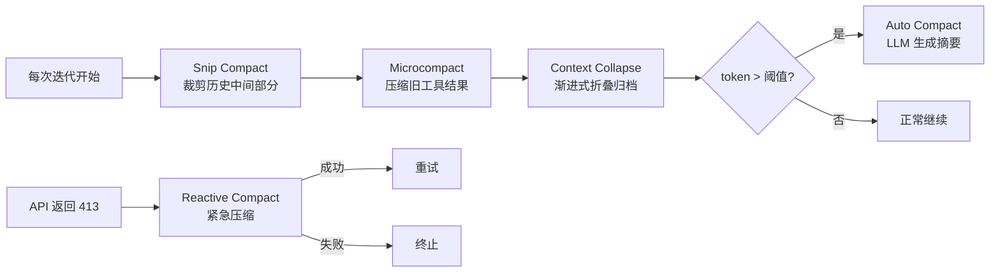
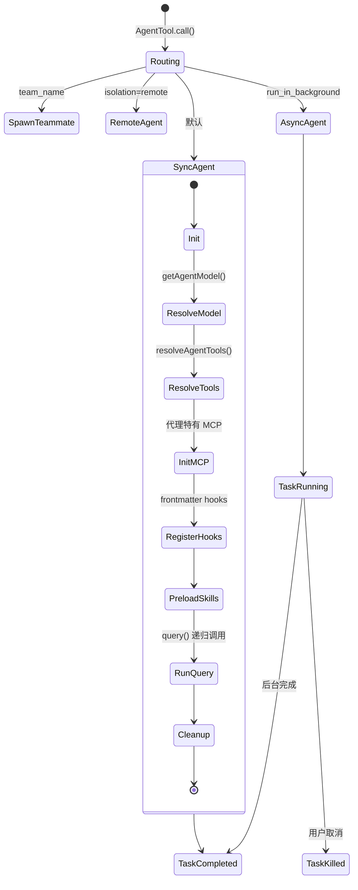
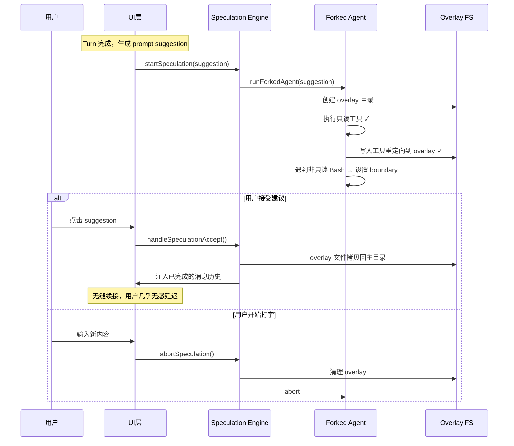
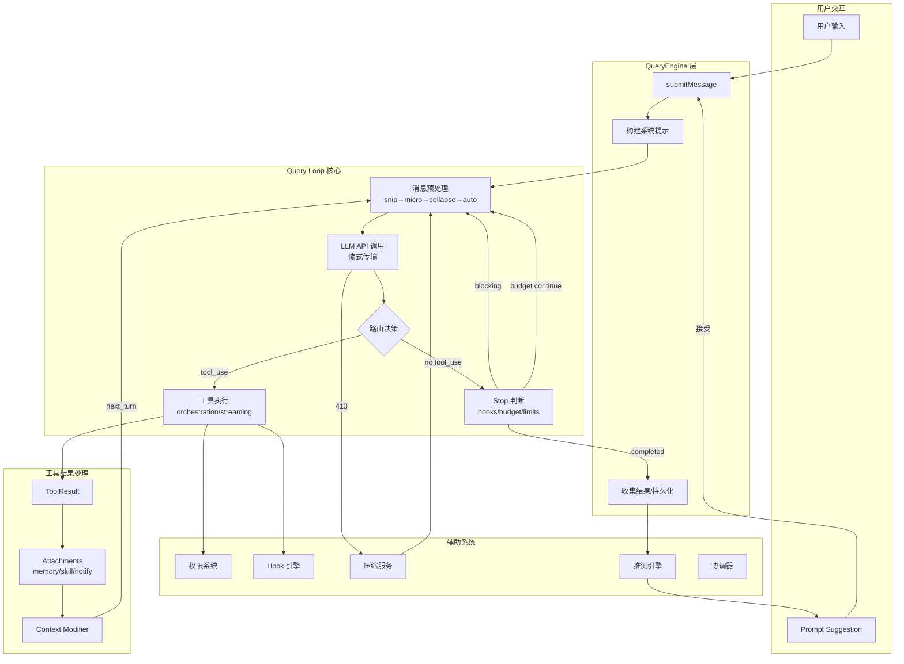

# Claude Code 框架循环决策架构分析报告

## 目录

- [1. 架构总览](#1-架构总览)
- [2. 核心循环引擎 (query.ts)](#2-核心循环引擎-queryts)
- [3. 状态转换系统](#3-状态转换系统)
- [4. 工具编排与执行](#4-工具编排与执行)
- [5. 流式工具执行器 (StreamingToolExecutor)](#5-流式工具执行器-streamingtoolexecutor)
- [6. 权限决策系统](#6-权限决策系统)
- [7. Hook 拦截系统](#7-hook-拦截系统)
- [8. 上下文压缩策略](#8-上下文压缩策略)
- [9. Token 预算管理](#9-token-预算管理)
- [10. 子代理系统 (AgentTool)](#10-子代理系统-agenttool)
- [11. 协调器模式 (Coordinator)](#11-协调器模式-coordinator)
- [12. 推测性执行 (Speculation)](#12-推测性执行-speculation)
- [13. 错误恢复机制](#13-错误恢复机制)
- [14. 架构设计哲学](#14-架构设计哲学)

---

## 1. 架构总览

Claude Code（CC）框架的核心是一个 **AsyncGenerator 驱动的状态机循环**，通过 `while(true)` 无限循环实现 Agent 的持续推理与执行。整个系统采用分层架构：



**核心文件映射**：

| 文件                                            | 职责                                      |
| ----------------------------------------------- | ----------------------------------------- |
| `src/query.ts`                                | Agent 主循环（while-true 状态机）         |
| `src/QueryEngine.ts`                          | 会话管理（消息历史、系统提示、持久化）    |
| `src/Tool.ts`                                 | 工具接口定义（call/permissions/validate） |
| `src/tools.ts`                                | 工具注册表（30+ 工具实例化）              |
| `src/query/transitions.ts`                    | 终止/继续状态原因定义                     |
| `src/query/stopHooks.ts`                      | Stop Hook 执行与决策                      |
| `src/query/tokenBudget.ts`                    | Token 预算续传逻辑                        |
| `src/services/tools/toolOrchestration.ts`     | 工具并发/串行编排                         |
| `src/services/tools/StreamingToolExecutor.ts` | 流式工具执行器                            |
| `src/services/tools/toolExecution.ts`         | 权限检查 + 工具调用                       |
| `src/utils/permissions/permissions.ts`        | 多层权限决策                              |
| `src/utils/hooks.ts`                          | Hook 执行引擎                             |
| `src/services/compact/`                       | 6 种上下文压缩策略                        |

---

## 2. 核心循环引擎 (query.ts)

### 2.1 循环主体

`query()` 是一个 `AsyncGenerator<StreamEvent | Message, Terminal>` 函数，核心是 `while(true)` 循环：



### 2.2 循环内部状态

```typescript
type State = {
  messages: Message[]                    // 完整消息历史（跨迭代累积）
  toolUseContext: ToolUseContext          // 工具执行环境（权限、MCP、abort等）
  autoCompactTracking: AutoCompactTrackingState | undefined  // 压缩追踪
  maxOutputTokensRecoveryCount: number   // max_output_tokens 恢复重试计数（≤3）
  hasAttemptedReactiveCompact: boolean   // 防止 reactive compact 无限循环
  maxOutputTokensOverride: number | undefined  // 输出 token 上限覆盖值
  pendingToolUseSummary: Promise<ToolUseSummaryMessage | null> | undefined
  stopHookActive: boolean | undefined    // stop hook 是否正在活跃
  turnCount: number                      // 当前 turn 计数
  transition: Continue | undefined       // 上一次迭代的继续原因（用于追踪）
}
```

### 2.3 QueryEngine 与 query 的关系

```
QueryEngine（外壳）                  query（内核）
├─ 管理完整对话历史                  ├─ 纯循环逻辑
├─ 构建系统提示词                    ├─ 通过 QueryDeps 注入 I/O
├─ 处理 slash 命令                   ├─ 生成器模式 yield 事件
├─ 权限包装                          ├─ 管理单 turn 内状态
├─ transcript 持久化                 └─ return Terminal 终止
├─ SDK 消息格式化
└─ 调用 query() 获取结果
```

`QueryEngine.submitMessage()` 是每个用户 turn 的入口，它：

1. 解析用户输入（slash commands、token budget 标记）
2. 构建系统提示词（CLAUDE.md + git context + 日期等）
3. 调用 `query()` 进入循环
4. 收集 yield 的 StreamEvent 推送给 UI
5. 持久化 transcript

---

## 3. 状态转换系统

### 3.1 终止状态 (Terminal)

循环通过 `return Terminal` 退出，共 10 种终止原因：

| 原因                    | 触发条件                             | 语义         |
| ----------------------- | ------------------------------------ | ------------ |
| `completed`           | 模型未请求工具，stop hooks 不阻止    | 正常完成     |
| `aborted_streaming`   | 用户中断（Ctrl+C）在 API 流式阶段    | 用户主动取消 |
| `aborted_tools`       | 用户中断在工具执行阶段               | 用户主动取消 |
| `model_error`         | API 调用抛出不可恢复异常             | LLM 层错误   |
| `prompt_too_long`     | 上下文超限且 reactive compact 失败   | 上下文溢出   |
| `image_error`         | 图像大小/格式错误                    | 输入格式错误 |
| `max_turns`           | 达到 `maxTurns` 参数限制           | 安全限制     |
| `blocking_limit`      | 硬 token 上限且 auto-compact 关闭    | 资源耗尽     |
| `hook_stopped`        | PreToolUse/PostToolUse hook 阻止继续 | Hook 干预    |
| `stop_hook_prevented` | Stop hook 明确阻止完成               | Hook 干预    |

### 3.2 继续状态 (Continue)

循环通过 `state = newState; continue` 继续，共 8 种继续原因：

| 原因                           | 触发条件                    | 后续动作                 |
| ------------------------------ | --------------------------- | ------------------------ |
| `next_turn`                  | 有 tool_use → 工具执行完成 | 带结果重新调用 LLM       |
| `reactive_compact_retry`     | prompt_too_long 后压缩成功  | 压缩后重试 API 调用      |
| `max_output_tokens_escalate` | 首次碰到输出限制            | 从 8k 升级到 64k 重试    |
| `max_output_tokens_recovery` | 升级后仍碰限制              | 注入"继续"消息（≤3 次） |
| `stop_hook_blocking`         | stop hook 返回阻塞错误      | 注入错误消息后继续       |
| `token_budget_continuation`  | token 预算未用完            | 注入 nudge 后继续        |
| `auto_compact`               | 自动压缩触发                | 压缩后继续               |
| `collapse_drain_retry`       | context collapse 释放空间   | 重试                     |

### 3.3 决策优先级

当模型返回无 tool_use 的响应时，系统按以下优先级判断：

```
1. prompt_too_long?      → reactive compact → 重试/终止
2. max_output_tokens?    → escalate/recovery → 重试/终止
3. stop hooks blocking?  → 注入错误 → 继续
4. stop hooks prevent?   → 终止
5. token budget 未用完?  → nudge → 继续
6. 以上都不满足          → completed（正常终止）
```

---

## 4. 工具编排与执行

### 4.1 分区策略

`toolOrchestration.ts` 中的 `partitionToolCalls()` 将模型返回的 tool_use 块分为批次：

```
模型输出: [Read(A), Read(B), Grep(C), Write(D), Read(E)]
分区结果:
  Batch 1: [Read(A), Read(B), Grep(C)]  → 并发执行（全部 concurrencySafe）
  Batch 2: [Write(D)]                    → 串行执行（非并发安全）
  Batch 3: [Read(E)]                     → 并发执行
```

### 4.2 并发安全判定

每个工具通过 `isConcurrencySafe(parsedInput)` 自行声明：

| 工具类别                         | 并发安全    | 原因                                                   |
| -------------------------------- | ----------- | ------------------------------------------------------ |
| FileReadTool, GrepTool, GlobTool | ✅ 始终     | 只读操作                                               |
| WebFetchTool, WebSearchTool      | ✅ 始终     | 无副作用                                               |
| BashTool                         | ⚠️ 条件性 | 仅只读命令（通过 `checkReadOnlyConstraints()` 判定） |
| FileWriteTool, FileEditTool      | ❌ 始终     | 写操作可能冲突                                         |
| AgentTool                        | ❌ 始终     | 复杂状态操作                                           |

### 4.3 执行流程

```typescript
runTools(toolUseBlocks) {
  for (batch of partitionToolCalls(blocks)) {
    if (batch.isConcurrencySafe) {
      // 并发执行，并行度上限 = CLAUDE_CODE_MAX_TOOL_USE_CONCURRENCY（默认 10）
      yield* runToolsConcurrently(batch.blocks)
    } else {
      // 串行逐个执行
      yield* runToolsSerially(batch.blocks)
    }
  }
}
```

### 4.4 工具执行单元 (runToolUse)

每个工具调用的完整生命周期：



---

## 5. 流式工具执行器 (StreamingToolExecutor)

### 5.1 设计目标

**核心优化**：模型还在流式输出时就开始执行工具，减少总延迟。传统方式是等模型输出完所有 tool_use 块后再执行，流式执行器将这一过程流水线化。

### 5.2 工作机制



### 5.3 并发控制

```typescript
canExecuteTool(isConcurrencySafe: boolean): boolean {
  const executing = this.tools.filter(t => t.status === 'executing')
  return (
    executing.length === 0 ||
    (isConcurrencySafe && executing.every(t => t.isConcurrencySafe))
  )
}
```

规则：

- 空队列 → 任何工具可执行
- 有并发安全工具在执行 → 只有并发安全工具可加入
- 有非并发安全工具在执行 → 所有工具等待

### 5.4 结果顺序保证

`getCompletedResults()` 按工具接收顺序遍历队列，只有**前序工具都完成**才会 yield 后续工具的结果。这确保了消息历史的确定性。

### 5.5 错误级联

- **Bash 工具出错** → 触发 `siblingAbortController.abort('sibling_error')`，取消所有兄弟工具
- **非 Bash 工具出错** → 不取消兄弟（读取类工具相互独立）
- **Streaming fallback**（模型切换）→ 调用 `discard()` 丢弃所有未完成工具

---

## 6. 权限决策系统

### 6.1 多层决策链

权限系统是一个优先级从高到低的规则链：



### 6.2 权限模式 (Permission Modes)

| 模式                  | 行为                           | 使用场景   |
| --------------------- | ------------------------------ | ---------- |
| `default`           | 正常询问用户                   | 交互式使用 |
| `plan`              | 计划模式，需要审批             | 代码审查   |
| `acceptEdits`       | 自动接受文件编辑               | 信任模式   |
| `bypassPermissions` | 绕过大部分权限（安全检查除外） | 完全自动化 |
| `dontAsk`           | 将 ask 转为 deny               | 无头模式   |
| `auto`              | 使用 AI 分类器自动判断         | 智能审批   |

### 6.3 权限规则优先级

```
policySettings（组织策略）    ← 最高优先级
flagSettings（特性标记）
projectSettings（.claude/settings.json）
localSettings（本地用户设置）
userSettings（全局用户设置）
session（运行时授予）
cliArg（CLI 参数）           ← 最低优先级
```

### 6.4 Speculative Classifier

在权限对话框弹出的同时，后台启动 AI 分类器预判用户决策：

- 如果用户还未操作时分类器完成且**高置信度** → 自动允许/拒绝
- 这是一个与用户交互**竞赛**的机制，减少等待时间

---

## 7. Hook 拦截系统

### 7.1 完整 Hook 事件列表

系统支持 25+ 种 Hook 事件，覆盖 Agent 生命周期的每个阶段：

| 类别                   | 事件                   | 拦截点                        |
| ---------------------- | ---------------------- | ----------------------------- |
| **工具生命周期** | `PreToolUse`         | 工具执行前（可修改输入/拒绝） |
|                        | `PostToolUse`        | 工具执行后（可检查结果）      |
|                        | `PostToolUseFailure` | 工具执行失败后                |
| **循环控制**     | `Stop`               | 每个 turn 结束时              |
|                        | `StopFailure`        | 停止异常时                    |
| **会话生命周期** | `SessionStart`       | 会话开始                      |
|                        | `SessionEnd`         | 会话结束                      |
| **子代理**       | `SubagentStart`      | 子代理启动                    |
|                        | `SubagentStop`       | 子代理停止                    |
| **压缩**         | `PreCompact`         | 压缩前                        |
|                        | `PostCompact`        | 压缩后                        |
| **权限**         | `PermissionRequest`  | 权限请求发出                  |
|                        | `PermissionDenied`   | 权限被拒绝                    |
| **任务**         | `TaskCreated`        | 任务创建                      |
|                        | `TaskCompleted`      | 任务完成                      |
| **用户交互**     | `UserPromptSubmit`   | 用户提交输入前                |
|                        | `Notification`       | 通知事件                      |
| **配置/环境**    | `ConfigChange`       | 配置变更                      |
|                        | `CwdChanged`         | 工作目录变更                  |
|                        | `FileChanged`        | 文件变更                      |
|                        | `InstructionsLoaded` | 指令加载                      |

### 7.2 Hook 对循环的影响

**PreToolUse Hook 输出**：

```typescript
{
  hookSpecificOutput: {
    permissionDecision: 'allow' | 'deny',   // 覆盖权限
    updatedInput: Record<string, unknown>,   // 修改工具输入！
    additionalContext: string,               // 追加上下文
  }
}
```

**Stop Hook 的 3 种结果**：

1. **`blockingErrors`** — 返回错误消息，注入对话历史，循环继续（`stop_hook_blocking`）
2. **`preventContinuation`** — 明确阻止，循环终止（`stop_hook_prevented`）
3. **正常通过** — 不干预，循环结束（`completed`）

### 7.3 Hook 执行时序

```
用户输入
  → UserPromptSubmit hooks
  → 进入 query loop
    → API 调用 → 模型响应
    → 有 tool_use:
        → PreToolUse hooks → 权限检查 → tool.call() → PostToolUse hooks
    → 无 tool_use:
        → Stop hooks → 决策 {completed | blocking | prevented}
  → SessionEnd hooks
```

---

## 8. 上下文压缩策略

### 8.1 六种压缩机制

系统实现了 6 种渐进式压缩策略，按执行顺序：



### 8.2 各策略详解

| 策略                          | 触发时机     | 压缩方式                                                 | 压缩力度 |
| ----------------------------- | ------------ | -------------------------------------------------------- | -------- |
| **Snip Compact**        | 每次迭代前   | 裁剪消息历史的中间部分，保留头尾                         | 低       |
| **Microcompact**        | 每次迭代前   | 清理旧 tool_result（File Read/Bash/Grep 输出替换为摘要） | 中       |
| **Context Collapse**    | 每次迭代前   | 将多条历史消息折叠为单条摘要                             | 中       |
| **Auto Compact**        | token 超阈值 | 调用 LLM 生成完整上下文摘要                              | 高       |
| **Reactive Compact**    | API 413 错误 | 紧急调用 LLM 压缩（last resort）                         | 高       |
| **Cached Microcompact** | ant-only     | 利用 API cache editing 能力删除内容                      | 中       |

### 8.3 Auto Compact 阈值

```
threshold = effectiveContextWindow - 13000 (buffer)
effectiveContextWindow = contextWindow(model) - min(maxOutputTokens, 20000)
```

例如对 200k context 模型：`threshold = 200000 - 20000 - 13000 = 167000 tokens`

---

## 9. Token 预算管理

### 9.1 预算指定方式

用户可通过多种语法指定 token 预算：

- 开头简写：`+500k 请帮我重构`
- 结尾简写：`请帮我重构 +1m`
- 详细格式：`use 2M tokens`

### 9.2 预算追踪状态

```typescript
BudgetTracker = {
  continuationCount: number    // 自动续接次数
  lastDeltaTokens: number      // 上次检查以来的 token 增量
  lastGlobalTurnTokens: number // 上次检查时的全局 turn token 数
  startedAt: number            // 追踪开始时间
}
```

### 9.3 续传决策逻辑

```mermaid
graph TD
    A[模型自然停止] --> B{是子代理?}
    B -->|是| STOP[停止]
    B -->|否| C{有 token 预算?}
    C -->|否| STOP
    C -->|是| D{已消耗 >= 90%?}
    D -->|是| STOP
    D -->|否| E{检测到递减回报?}
    E -->|是| STOP
    E -->|否| F[注入 nudge 消息<br/>"Stopped at X% of token target.<br/>Keep working — do not summarize."]
    F --> CONTINUE[继续循环]
```

**递减回报检测**：连续 3 次续接后，如果最近两次 token 增量都 < 500 → 判定为递减回报 → 停止。

---

## 10. 子代理系统 (AgentTool)

### 10.1 子代理类型

| 类型          | 启动方式                    | 特点                 |
| ------------- | --------------------------- | -------------------- |
| 同步代理      | 阻塞父循环                  | 共享 abortController |
| 异步代理      | `run_in_background: true` | 独立 abortController |
| 团队代理      | `team_name + name`        | tmux/进程内 teammate |
| 远程代理      | `isolation: 'remote'`     | 远程环境执行         |
| Fork 代理     | `isForkSubagentEnabled()` | 继承父级完整上下文   |
| Worktree 隔离 | `isolation: 'worktree'`   | Git worktree 隔离    |

### 10.2 子代理生命周期



### 10.3 权限隔离

子代理有独立的权限域：

- 可定义自己的 `permissionMode`
- `allowedTools` 替换父级 allow rules（不泄漏）
- `bypassPermissions`/`acceptEdits` 始终从父级覆盖
- `bubble` 模式允许权限弹窗冒泡到父终端

---

## 11. 协调器模式 (Coordinator)

### 11.1 架构

```
┌─────────────────────────────────────────────────────┐
│  Coordinator（协调者）                                │
│  角色: 理解意图 → 分解任务 → 调度 worker              │
│  工具: AgentTool, SendMessageTool, TaskStopTool     │
└───────────────────────────┬─────────────────────────┘
                            │ <task-notification> XML
          ┌─────────────────┼─────────────────┐
          ▼                 ▼                 ▼
      Worker A          Worker B          Worker C
      (研究)            (实现)            (验证)
      有独立工具集      有独立工具集      有独立工具集
      独立 context      独立 context      独立 context
```

### 11.2 Worker 通知格式

```xml
<task-notification>
  <task-id>{agentId}</task-id>
  <status>completed|failed|killed</status>
  <summary>Agent "researcher" completed</summary>
  <result>发现了 3 个相关文件...</result>
  <usage>
    <total_tokens>15234</total_tokens>
    <tool_uses>7</tool_uses>
    <duration_ms>12500</duration_ms>
  </usage>
</task-notification>
```

### 11.3 Scratchpad 机制

Worker 之间通过 scratchpad 目录共享知识：

- 无需权限提示即可读写
- 用于跨 worker 持久化中间结果
- Coordinator 可指导 worker 将关键发现写入 scratchpad

---

## 12. 推测性执行 (Speculation)

### 12.1 概念

在用户还未确认下一步操作时，系统基于 **prompt suggestion**（AI 预测的下一个用户输入）**预先执行**工具调用。如果用户接受建议，直接注入已完成的执行结果。

### 12.2 执行机制



### 12.3 权限网关

推测执行中的工具权限策略：

| 工具类型                   | 决策        | 原因                     |
| -------------------------- | ----------- | ------------------------ |
| 只读工具（Read/Glob/Grep） | ✅ 允许     | 无副作用                 |
| 只读 Bash                  | ✅ 允许     | 无副作用                 |
| 写入工具（Edit/Write）     | ⚠️ 重定向 | 写入 overlay（写时复制） |
| 非只读 Bash                | ❌ 边界     | 不可安全推测             |
| 其他工具                   | ❌ 边界     | 不确定安全性             |

### 12.4 边界类型

| Boundary        | 含义             | 后续                       |
| --------------- | ---------------- | -------------------------- |
| `bash`        | 遇到非只读命令   | 推测中止，接受后需继续执行 |
| `edit`        | 遇到需权限的编辑 | 推测中止，接受后需继续执行 |
| `denied_tool` | 遇到不允许的工具 | 推测中止                   |
| `complete`    | 自然完成         | 完整推测结果可用           |

### 12.5 流水线推测

推测完成后立即异步生成下一个 prompt suggestion（`generatePipelinedSuggestion`），实现连续推测链，最大化利用用户思考时间。

---

## 13. 错误恢复机制

### 13.1 分层错误处理

| 错误类型                   | 恢复策略                                                  | 最大重试         |
| -------------------------- | --------------------------------------------------------- | ---------------- |
| `FallbackTriggeredError` | 切换到 fallback model，清除已有结果，重新开始             | 1 次             |
| `prompt_too_long (413)`  | context collapse drain → reactive compact → 终止        | 2 步             |
| `max_output_tokens`      | escalate 到 64k → 注入 recovery message → 终止          | 3 次             |
| `ImageSizeError`         | 直接终止，返回友好错误消息                                | 0                |
| 工具执行异常               | 捕获异常，作为 `tool_result(is_error: true)` 返回给模型 | 模型自行决定     |
| 工具输入验证失败           | Zod 解析错误作为 tool_result 错误返回                     | 模型自行修正     |
| 权限拒绝                   | 生成 reject message 作为 tool_result                      | 模型选择替代方案 |
| abort signal               | 各阶段检查 → 生成中断消息 → 终止                        | 0                |

### 13.2 模型 Fallback

```
Primary Model (如 Opus)
    │ FallbackTriggeredError
    ▼
Fallback Model (如 Sonnet)
    - tombstone 已有 assistant messages
    - 清除累积状态
    - 用新模型重新开始整个 turn
```

### 13.3 工具错误反馈循环

工具执行失败时，错误信息以 `is_error: true` 的 tool_result 返回给模型，形成自修复循环：

```
模型: 调用 FileEdit(path="foo.ts", old="abc", new="xyz")
工具: 错误！old_string 在文件中未找到
模型: [分析错误] → 调用 FileRead(path="foo.ts") 读取实际内容
模型: 调用 FileEdit(path="foo.ts", old="actual_content", new="xyz")  ← 修正后的调用
```

---

## 14. 架构设计哲学

### 14.1 核心设计原则

| 原则                 | 体现                                                                 |
| -------------------- | -------------------------------------------------------------------- |
| **生成器驱动** | `query()` 是 AsyncGenerator，通过 yield 推送事件，通过 return 终止 |
| **依赖注入**   | `QueryDeps` 注入 I/O 操作（callModel, compact），便于测试          |
| **状态机模式** | 明确的 Terminal/Continue 状态转换，避免 spaghetti 逻辑               |
| **渐进式降级** | 压缩从轻到重：snip → micro → collapse → auto → reactive          |
| **竞赛机制**   | 权限分类器与用户对话框竞赛，推测执行与用户输入竞赛                   |
| **分层安全**   | 多层权限规则 + 安全底线检查 + Hook 拦截                              |
| **流水线化**   | StreamingToolExecutor 实现 LLM 输出与工具执行的重叠                  |
| **自修复**     | 工具错误反馈给模型，由模型自行修正                                   |

### 14.2 性能优化策略

```
1. 流式工具执行     — 不等模型输出完就开始执行工具
2. 推测性执行       — 用户思考时预执行可能的下一步
3. 并发工具执行     — 只读工具并行，写工具串行
4. 渐进式压缩       — 避免一次性重压缩带来的延迟
5. Speculative 分类 — 权限判断与用户交互并行
6. 流水线推测       — 推测完成立即生成下一个建议
```

### 14.3 系统边界与约束

```
┌─────────────────────────────────────────┐
│           安全边界                        │
│  ┌─────────────────────────────────┐    │
│  │  .git/ .claude/ 保护             │    │
│  │  始终需要确认，bypass 无法绕过    │    │
│  └─────────────────────────────────┘    │
│                                         │
│  ┌─────────────────────────────────┐    │
│  │  maxTurns 硬限制                 │    │
│  │  防止无限循环                     │    │
│  └─────────────────────────────────┘    │
│                                         │
│  ┌─────────────────────────────────┐    │
│  │  Token 预算 + 递减回报检测       │    │
│  │  防止资源浪费                     │    │
│  └─────────────────────────────────┘    │
│                                         │
│  ┌─────────────────────────────────┐    │
│  │  abort signal 全链路检查         │    │
│  │  用户始终可以中断                 │    │
│  └─────────────────────────────────┘    │
└─────────────────────────────────────────┘
```

---

## 附录：关键数据流全景图



---

*报告生成时间：2026-05-28*
*分析对象：Claude Code 源码（d:\WorkSpace\aiAgent\claude-code-source）*
